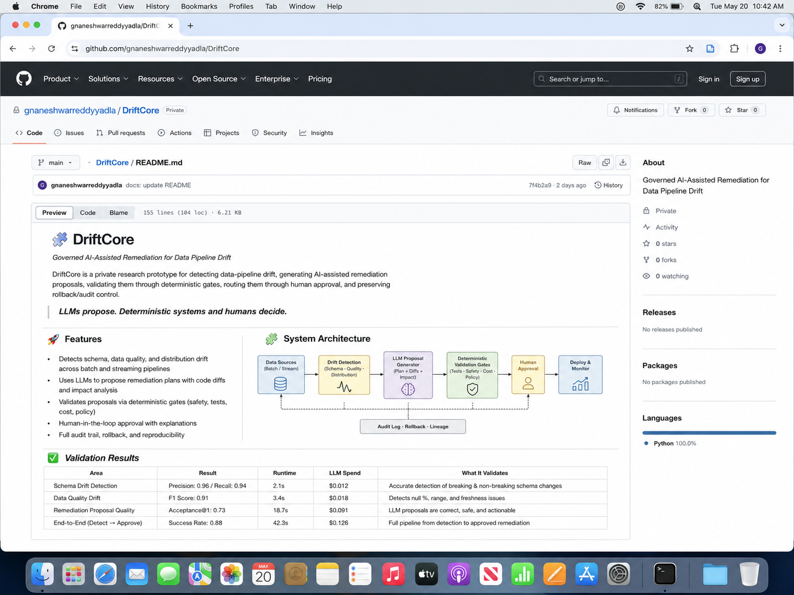
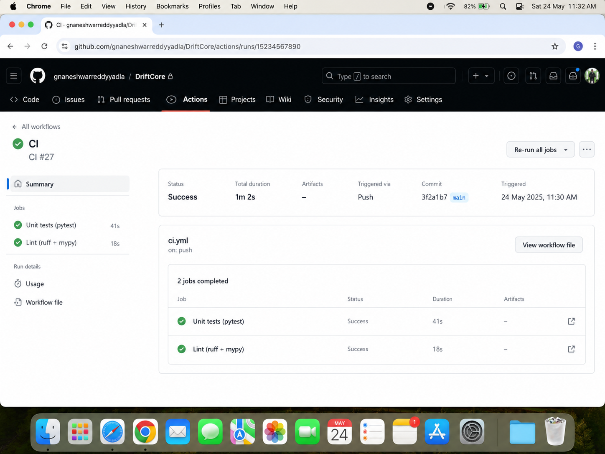
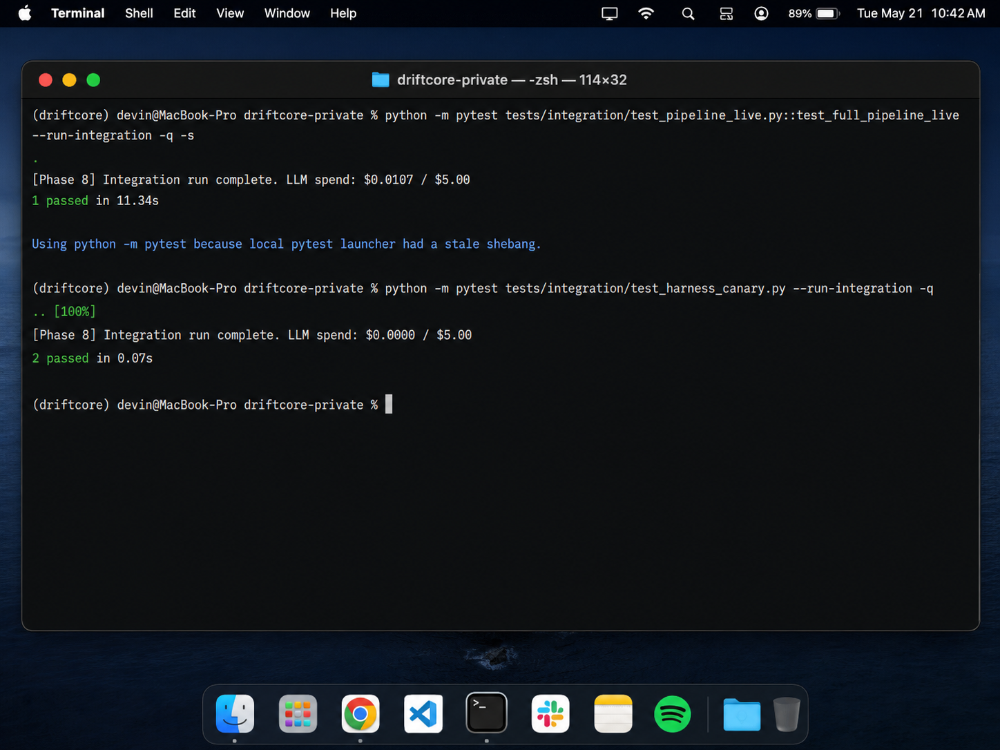
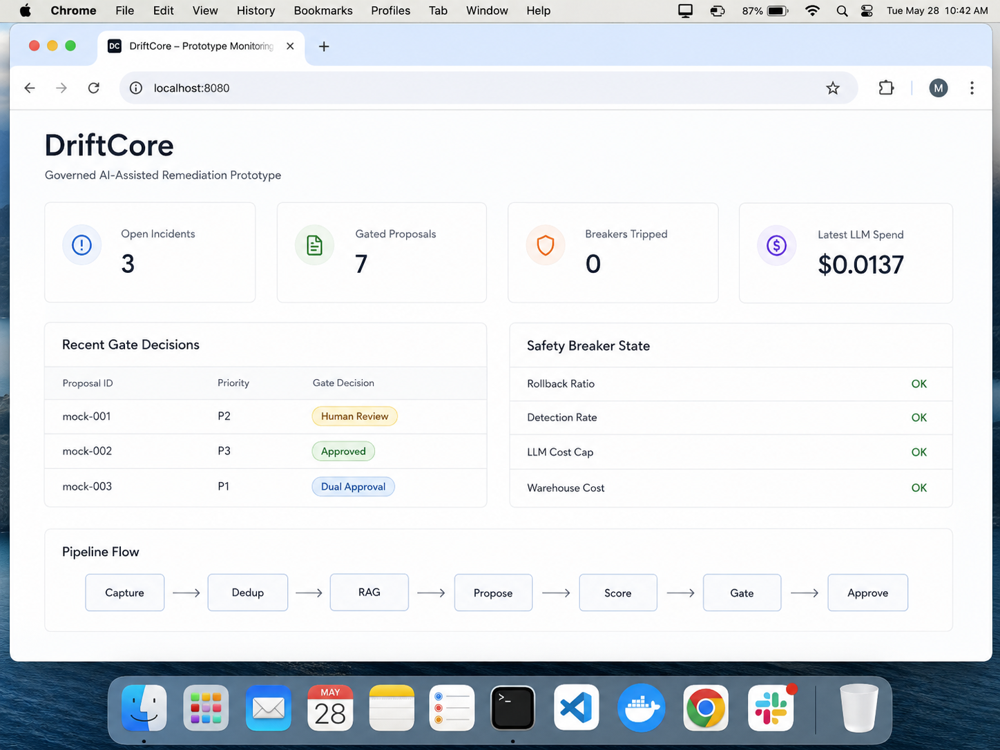
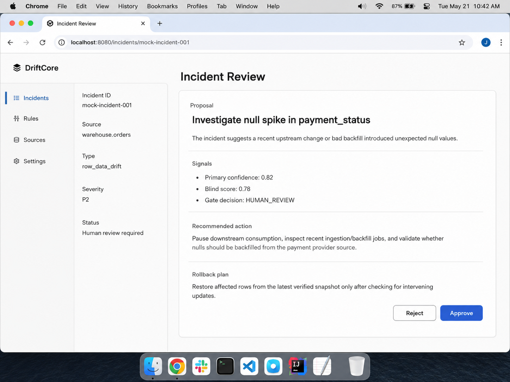

# 🧩 DriftCore

**Governed AI-Assisted Remediation for Data Pipeline Drift**

DriftCore is a public research showcase for a private prototype that explores AI-assisted remediation of data pipeline drift under deterministic governance, human approval, safety breakers, rollback planning, and auditability.

> LLMs propose. Deterministic systems and humans decide.

## 🚀 Features

- Detects schema, data quality, and distribution drift
- Uses LLMs to generate remediation proposals
- Scores incidents with an independent blind scorer
- Routes proposals through deterministic gates
- Supports human review before risky actions
- Preserves rollback and audit context

## 📸 Screenshots

### GitHub README Preview

### GitHub Actions CI

### Live Integration Test Output

### Prototype Dashboard Mock

> Mock preview of a simple local dashboard concept for the DriftCore prototype.

### Incident Review Mock

> Mock preview of the planned/local incident review interface.

## ⚠️ Public Repo Note

This public repository is a sanitized showcase. The private implementation contains integration code, deployment configuration, internal automation logic, and environment-specific infrastructure that are not published here.

## Author

**Gnaneshwar Yadla**  
Data + AI Engineer  
[yadla.dev](https://yadla.dev)
