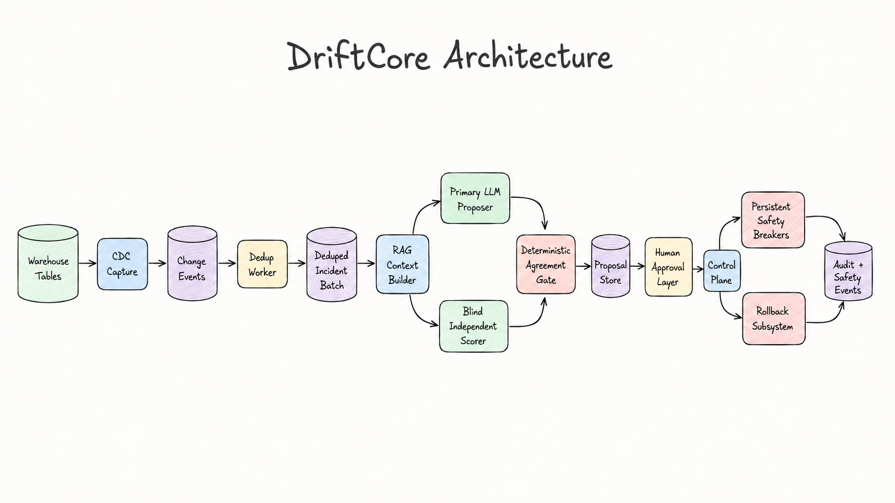
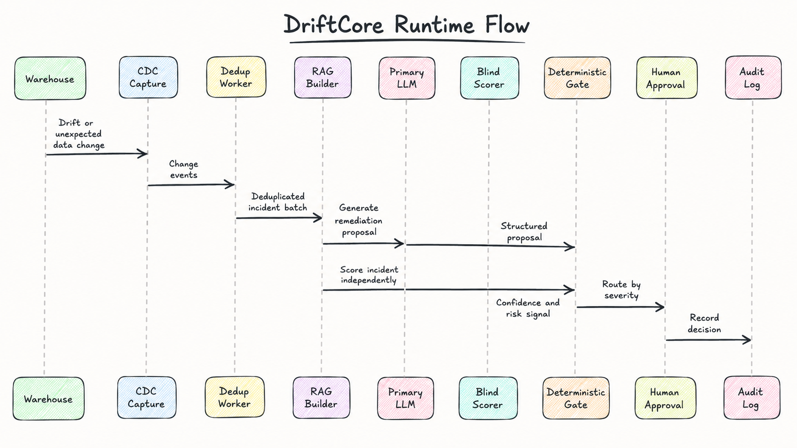
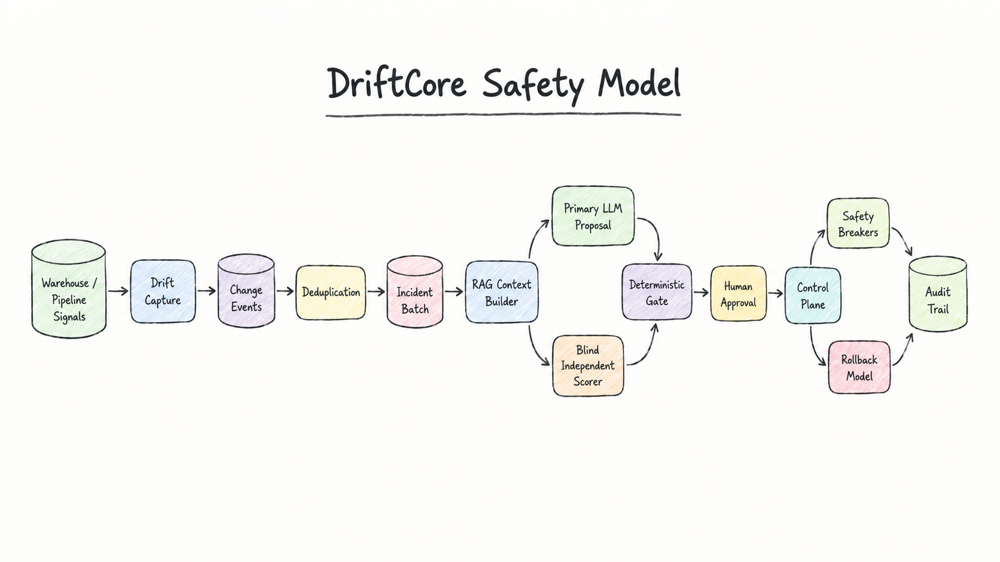

# DriftCore Architecture

DriftCore is organized as a governed remediation control plane rather than a single autonomous agent.

## System Architecture

## Runtime Flow

## Safety Model

## Component Boundaries

| Component | Contract |
|---|---|
| Drift Capture | Converts warehouse changes into structured change events |
| Dedup Worker | Groups correlated symptoms into incident batches |
| RAG Context Builder | Builds compact incident context from metadata, prior events, and lineage |
| Primary Proposer | Generates a structured remediation proposal |
| Blind Scorer | Produces an independent confidence/risk signal without seeing the proposal |
| Deterministic Gate | Routes the proposal based on fixed thresholds and severity policy |
| Approval Layer | Captures human review decisions and approval records |
| Control Plane | Owns state transitions, locks, idempotency, and execution coordination |
| Safety Breakers | Pauses or degrades automation when risk signals trip |
| Rollback Model | Records rollback plans, checks intervening changes, and tracks rollback events |
